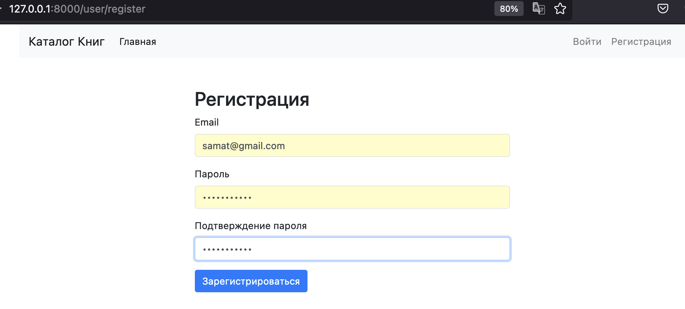

# Каталог книг

## Описание

Проект "Каталог книг" предназначен для создания каталога книг с возможностью оставлять отзывы и рейтинг. Книги классифицируются по жанрам, авторам. Пользователи могут добавлять книги в избранное, а также регистрироваться и авторизовываться через электронную почту.

## Требования к проекту

1. Использовать DRF.
2. Написать чистый код.
3. Построить чистую архитектуру.
4. Возможность использования базы данных sqlite.
5. Ендпоинты должны быть релевантны для SEO-оптимизации (опционально).
6. Использование drf-yasg для swagger документации (опционально).

## Основные возможности

- Просмотр списка книг с возможностью фильтрации по жанрам, авторам и дате публикации.
- Просмотр деталей книги, включая описание, дату публикации и список отзывов.
- Добавление книги в избранное.
- Регистрация/авторизация через email.
- Создание контента через админку.

## Эндпоинты

### Web

1. Главная страница со списком книг: `'/book/'`.
2. Детали книги: `'/book/<uuid:pk>/'`.
3. Добавить книгу в избранное: `'/add_to_favorite/<uuid:book_id>/'`.
4. Добавить отзыв к книге: `'/book/<uuid:pk>/add_review/'`.

### API (начало всех URL: `localhost:8000/api/`)

1. Получение списка книг и применение фильтров: `api/books/`.
2. Добавление отзыва к книге: `api/books/{id}/add_review/`.
3. Изменение статуса книги в избранном: `api/books/{id}/toggle_favorite_status/`.

## Просмотр документации по API

Чтобы ознакомиться с документацией по API, откройте ваш веб-браузер и перейдите по одной из следующих ссылок:

- Для Swagger документации:
  [http://127.0.0.1:8000/swagger/](http://127.0.0.1:8000/swagger/)

- Для Redoc документации:
  [http://127.0.0.1:8000/redoc/](http://127.0.0.1:8000/redoc/)


## Скриншоты

### WEB   
Главная страница  


- Детальная страница книги - Информация, Комментарии, Рейтинги, Оставление отзыва, Добавление в избранное 


- Фильтрация книги


- Добавление в избранное


- Избранное на главной странице


- Авторизация по почте:


- Регистрация по почте:


- Отправка письма подтв. на почту:


- Получение письма:


- Активация аккаунта:


# API (начало всех URL: `localhost:8000/api/`)

- api/books/


- Swagger документация


a
- Redoc документация


## Установка и запуск

1. **Клонирование репозитория**:

\```
git clone https://github.com/almazuulu/BookCatalogue.git
cd bookcatalogue
\```

2. **Установка виртуального окружения** (опционально, но рекомендуется):
\```
python -m venv venv
source venv/bin/activate  # для Linux/macOS
# или
venv\Scripts\activate     # для Windows
\```

3. **Установка зависимостей**:
\```
pip install -r requirements.txt
\```

4. **Применение миграций**:
\```
python manage.py migrate
\```

4.1. **Опционально после команды migrate можете запустить**:
\```
python manage.py loaddata data.json
\```

admin: almazuulu@gmail.com
password: qwerty1234$

5. **Запуск сервера**:
\```
python manage.py runserver
\```

6. **Создание суперпользователя (для доступа к админ-панели)**:
\```
python manage.py createsuperuser
\```

7. **Запуск сервера**:
\```
python manage.py runserver
\```

8. **Доступ к админ-панели**:

1. Откройте веб-браузер и перейдите по адресу: `http://localhost:8000/admin/`.

2. Войдите с учетными данными суперпользователя, которые вы создали на шаге 5 установки.

3. Используйте админ-панель для управления книгами и другим контентом вашего проекта.


